## Úvod do jazyka Kotlin

[Jazyk Kotlin](https://kotlinlang.org) je pomerne mladý jazyk, ktorý vznikol na základe jazyka Java, aby sa dali medzi sebou ľahko nahrádzať. Hovoríme aj, aby boli navzájom kompatibilné. V tomto jazyku je možné programovať aplikácie pre operačný systém [Android](https://www.android.com).

Je to moderný programovací jazyk, ktorý je

- Jednotný (konzistentný) – je vždy jasné, čo je zapísané
- Bezpečný – pri práci sa robí menej chýb, ako pri práci s Javou
- Medzioperačný – dá sa používať všade tam, kde Java: server, Android, …
- Dá sa programovať v rôznych nástrojoch

### Vývojové prostredie

Na základnú prácu a spoznanie sa s jazykom Kotlin budeme používať softvér, ktorý je zadarmo a volá sa [IntelliJ IDEA](https://www.jetbrains.com/idea/). Ten si treba stiahnuť a otvoriť, aby sme mohli začať.

### Vytvorenie nového projektu v IntelliJ IDEA

V IntelliJ IDEA potrebujeme po spustení urobiť pár základných úkonov, aby sme mohli napísať prvý program v jazyku Kotlin.

[](images/NewProject.png)

1. Ako **Project SDK** vybrať konkrétnu verziu Javy, ktorá by v IntelliJ IDEA mala byť už doinštalovaná.
2. V časti **Additional Libraries and Frameworks** zaškrtnúť voľbu **Kotlin (Java)**
3. **Use Library** by malo obsahovať *KotlinJavaRuntime*
4. **Next**

Ďalším krokom je výber šablóny. Tento krok teraz preskakujeme, vôbec nás nezaujíma, nakoľko začneme s jazykom Kotlin *na čistom papieri*, ako sa hovorí.

[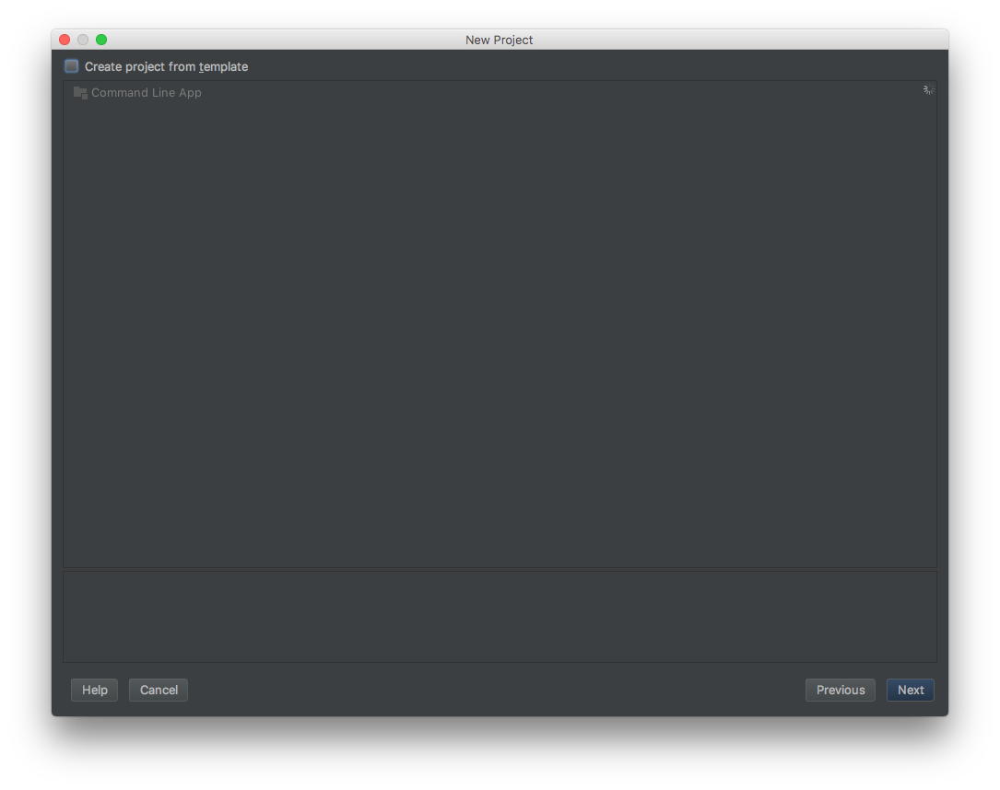](images/Template.png)

Zadáme **Next**.

[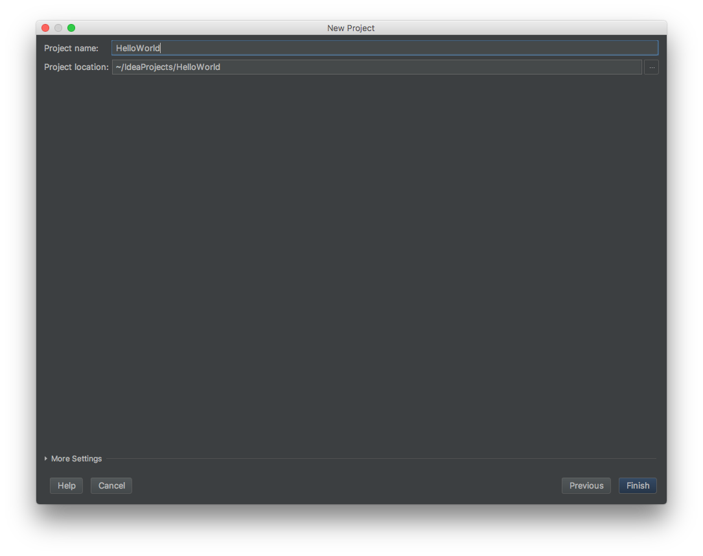](images/Name.png)

V ďalšom kroku zadáme meno nového projektu. V ukážke to je **Hello World** a zadáme **Finish**.

### Nastavenie projektu

Teraz sa otvorí obrazovka projektu *Hello World*.

[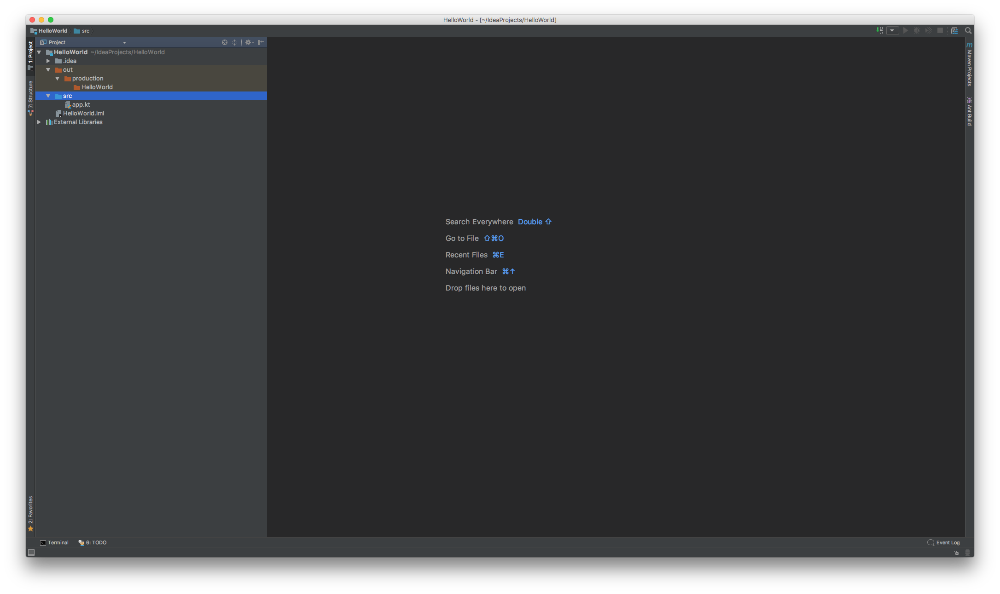](images/Project.png)

Teraz je dôležité nastaviť jazyk Kotlin v projekte pomocou **Tools > Kotlin > Configure Kotlin in Project > All modules containing Kotlin files**. Zvyšok ponecháme tak, ako je a potvrdíme **OK**.

[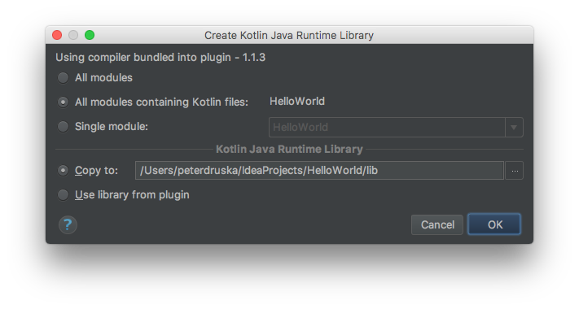](kotlin/images/ConfigureKotlin.png)

### Štruktúra projektu

Zatiaľ nás bude zaujímať zo štruktúry projektu zložka `/src/`.

[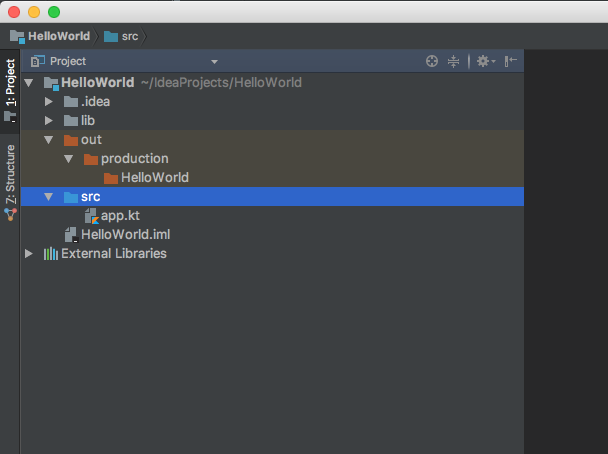](images/Src.png)

Vyznačíme ju a klikneme pravým tlačidlom. Po zobrazení ponuky vyberieme `New > Kotlin File/Class`.

[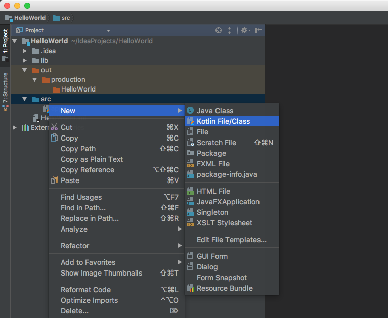](images/KotlinFile.png)

Potom zadáme meno nového súboru, napr. **HelloWorld** a potvrdíme **OK**.

[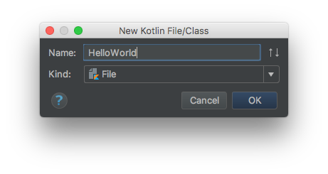](images/FileName.png)

IntelliJ IDEA teraz pripraví a otvorí nový súbor na úpravu.

[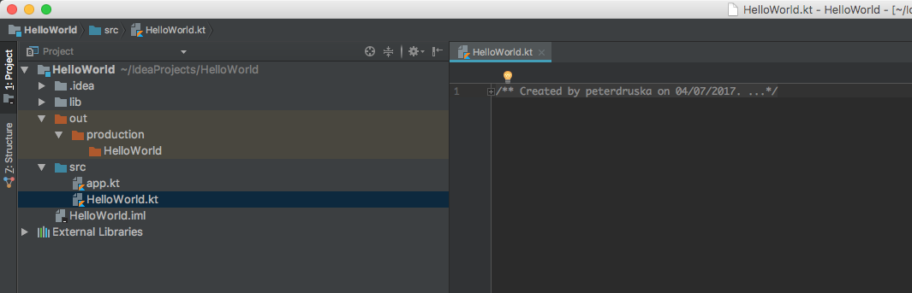](images/EditFile.png)

## Prvý program

V otvorenom súbore **HelloWorld.kt** napíšeme `main` a stlačíme tabulátor.

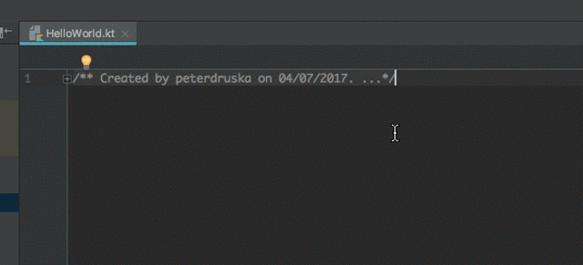

IntelliJ IDEA automaticky doplní hlavnú funkciu, do ktorej budeme písať akýkoľvek program v začiatkoch. Nebudeme sa teraz zaoberať, čo je funkcia, prečo sa táto volá `main`, ani čo je to tam popísané. Momentálne nám pôjde o to, čo bude v zložených zátvorkách `{}`.

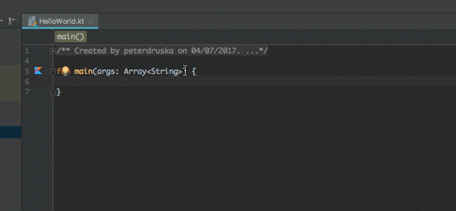

Aby sme ten prvý program skúsili, do spomínaných zložených zátvoriek napíšeme tento príkaz:

```kotlin
println("Toto je môj prvý program v jazyku Kotlin!")
```

Funkcia `main` bude vyzerať nasledovne:

```kotlin
fun main(args: Array<String>) {
    println("Toto je môj prvý program v jazyku Kotlin!")
}
```

Pre spustenie programu pravým tlačidlom klikneme do programu, ktorý sme práve napísali a vyberiem **Run HelloWorldKt**.

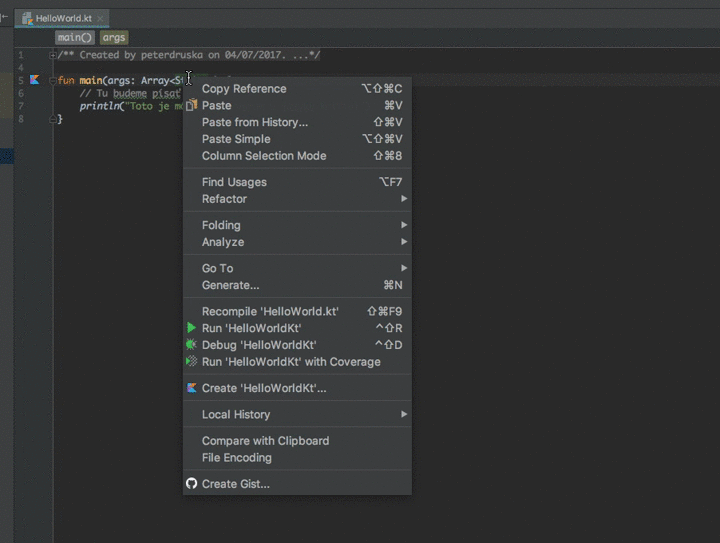

Výsledok vidíme v dolnej časti, v tzv. konzole.

[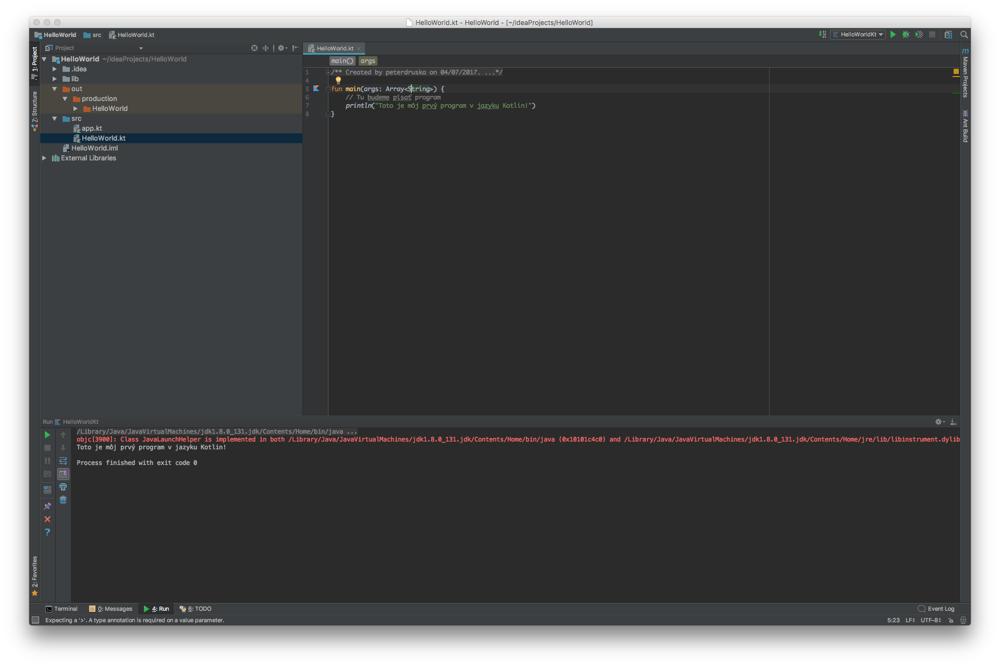](images/Console.png)

Kde sa vypísal text *Toto je môj prvý program v jazyku Kotlin!*

[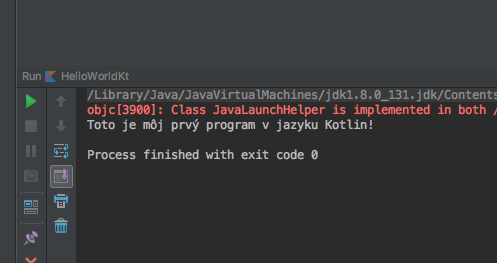](images/Console2.png)

O funkcii `println()` si povieme viac neskôr.

## Základné dátové typy

Pri programovaní budeme vždy pracovať s typmi údajov. V bežnom živote sa môžeme stretnúť s číslami, s textami a podobne. V jazyku Kotlin to je podobné a zo začiatku budeme rozlišovať tri jednoduché dátové typy: **textové reťazce** (`String`), **celé** čísla (`Int`), **reálne čísla** (`Double`).

### Int

Celé čísla sú jednoduché na rýchle pochopenie. Píšu sa bez desatinnej bodky. Skúsme do funkcie `main` napísať tento zdrojový kód:

```kotlin
println(3 + 4)
```

Funkcia `main` bude teda vyzerať takto:

```kotlin
fun main(args: Array<String>) { 
    println(3 + 4)
}
```

Keď program spustíme, výsledok bude vypísaný do konzoly, výsledok bude **7**. Rovnakým spôsobom sa dajú robiť akékoľvek základné matematické operácie.

### Double

Reálne čísla sa zapisujú s desatinnou bodkou. Skúsme napr.:

```kotlin
fun main(args: Array<String>) { 
    println(2.9 + 4.1)
}
```

Výsledok bude **7.0**.

Rozdiel medzi celým a reálnym číslom v programovacom jazyku Kotlin je dosť podstatný. Náš mozog tie čísla berie za rovnaké, pre počítače sú však odlišné a inak k nim musíme pristupovať. Napr. pri celočíselnom delení so zvyškom musíme byť v tomto veľmi opatrní.

### String

Ďalším jednoduchým typom sú reťazce. S nimi sme sa stretli pri prvej ukážke. Každý reťazec sa totiž zapisuje do úvodzoviek. Keď ho chceme vypísať do konzoly, použijeme takýto zápis:

```kotlin
println("Toto je super reťazec 3000!")
```

Všetko, čo je uzavreté do úvodzoviek sa chápe ako reťazec, čiže usporiadná množina znakov. Uvedené číslo 3000 je v tomto príklade pre jazyk Kotlin tiež reťazec, nie číslo.

Spustenie tohto programu vypíše text „**Toto je super reťazec 3000!**“.

## Konštanty

Keď chceme uchovávať nejakú hodnotu, napr. číslo 3,14 a používať ju v programe na viacerých miestach bez toho, aby sme si túto hodnotu museli pamätať alebo neustále zapisovať, použijeme konštantu. Definuje sa takto:

```kotlin
val pi = 3.1415
```

Definícia začína vyhradeným slovom `val`, za ktorým ide vlastné meno, ktoré určujeme my. Potom spravidla nasleduje znamienko rovná sa `=` a za ním hodnota, ktorú táto konštanta nadobúda.

Keď chceme vypočítať obvod kruhu, použitie konštánt bude nasledovné:

```kotlin
fun main(args: Array<String>) {
    val pi = 3.1415
    val r = 4.0
    val perimeter = 2 * pi * r
    println("Obvod kruhu s polomerom $r je $perimeter.")
}
```

### Definovanie typu

Definovanie konštanty vieme uskutočniť aj riadnym určeným typu. Napríklad pre vyššie definovanú konštantú **pí** to bude takto:

```kotlin
val pi: Double = 3.1415
```

Za meno konštanty zadáme dvojbodku a za ňou meno typu, v tomto prípade `Double`.

Rovnako sa určuje aj typ `Int` alebo `String`. Napríklad:

```kotlin
val retazec: String = "Toto je konštanta typu String"
val celeCislo: Int = 42
```

Konštanty sa preto volajú konštanty, lebo sú **konštantné** a nemôžu sa meniť. Čiže ak už máme konštantu `celeCislo` rovnú hodnote 42, neskôr v programe nemôžeme urobiť nové priradenie:

```kotlin
celeCislo = 43
```

Program potom zahlási chybu a nespustí sa. Napríklad takýto:

```kotlin
fun main(args: Array<String>) {
    val celeCislo: Int = 42 // prvé priradenie do konštanty
    celeCislo = 43 // toto sa nemôže už, konštanta sa nedá zmeniť po jej zadefinovaní
}
```

## Premenné

Aby sme im mohli hodnoty meniť, k dispozícii máme premenné, ktoré sa volajú premennými preto, že sa dajú **premeniť**. Teda ich hodnoty sa dajú premeniť.

Ich definícia začína vyhradeným slovom `var`:

```kotlin
var vekCloveka: Int = 18
```

Neskôr sa vek človeka môže prirodzene zmeniť kedykoľvek v programe:

```kotlin
fun main(args: Array<String>) {
    var vekCloveka: Int = 18 // prvé priradenie
    vekCloveka = 19 // druhé priradenie, premenná sa takto môže
}
```

A program žiadnu chybu nezahlási.

## Reťazce

Veľakrát budeme potrebovať pracovať s reťazcami. Napríklad potrebujeme vypísať oznam cestujúcim na autobusovej stanici, že autobus do Martina bude meškať 15 minút:

```kotlin
fun main(args: Array<String>) {
    val text: String = "Autobus do Martina bude meškať 15 minút."
    println(text)
}
```

Najprv definujeme konštantu `text` typu `String`, do ktorej vložíme reťazec s informáciou o meškaní. Na ďalšom riadku hodnotu tejto konštanty vypíšeme `println(text)`.

### Reťazce + konštanta/premenná

Čo ale v prípade, že autobus bude meškať 14 minút? A čo 13? A čo keď 23? Nedáva zmysel túto hodnotu neustále prepisovať v reťazci, keď ju môžeme odtiaľ vyňať a meniť ju na prehľadnejšom mieste tak, že z nej urobíme novú konštantu:

```kotlin
val delay: Int = 15
```

Následne textovú konštantu upravíme tak, aby sme hodnotu konštanty `delay` v ňom mali:

```kotlin
val text: String = "Autobus do Martina bude meškať $delay minút."
```

Čiže celý program bude takýto:

```kotlin
fun main(args: Array<String>) {
    val delay: Int = 15
    val text: String = "Autobus do Martina bude meškať $delay minút."
    println(text)
}
```

Teraz máme jedno pevné miesto, kde meškanie vždy upravíme podľa potreby a táto nová hodnota sa potom premietne do výsledného reťazca zavolaním mena konštanty/premennej pomocou symbolu dolár `$delay`.

### Spájanie reťazcov

Čo v prípade, že máme dva reťazce:

```kotlin
val words1: String = "Ahoj Svet."
val words2: String = "Učím sa programovať."
```

A chceme ich spojiť dohromady. Je to veľmi jednoduché:

```kotlin
val allWords: String = words1 + words2
```

Celý program:

```kotlin
fun main(args: Array<String>) {
    val words1: String = "Ahoj Svet."
    val words2: String = "Učím sa programovať."
    val allWords: String = words1 + words2
    println(allWords)
}
```

Vety by mali byť oddelené medzerou, preto pridajme medzeru medzi reťazce:

```kotlin
fun main(args: Array<String>) {
    val words1: String = "Ahoj Svet."
    val words2: String = "Učím sa programovať."
    val allWords: String = words1 + " " + words2
    println(allWords)
}
```

## Boolean - Rozhodovací typ

Jeden typ v programovaní sa tak trochu vymyká bežnému ľudskému chápaniu, ale len chvíľu. Potom si na človeka zasadne ako ovad a zvykne už nepustiť. Je to tzv. **rozhodovací typ**, v jazyku Kotlin sa označuje názvom `Boolean`. Premenná tohto typu vyzerá takto:

```kotlin
var delayed: Boolean = false
```

Okrem hodnoty `false` môže tento typ nadobúdať už len hodnotu `true`. Môžeme si ho predstaviť ako vypínač svetla: **svieti**, **nesvieti**.

### Logika vecí

Typ `Booblean` sa používa pri logickom uvažovaní, rozhodovaní. Napríklad skúsme tento program:

```kotlin
fun main(args: Array<String>) {
    println(3 < 4)
}
```

Hodnota `true` vo výpise je typu `Boolean`. Rovnakým spôsobom môžeme zadať rôzne porovnávacie operácie:

```kotlin
>  // väčší
<  // menší
>= // väčší rovný
<= // menší rovný
!= // rôzny
== // rovný
```

Ich výsledkom bude práve typ `Boolean`, a síce hodnota `true` alebo `false`. Skúsme niečo takéto:

```kotlin
fun main(args: Array<String>) {
    val solution: Boolean = 42 >= 15
    println(solution)
}
```

Výsledok znovu vypíše ako `true`. Vyššie uvedený zápis vyzerá zvláštne, no robí len toľko, že výsledok porovnania `42 >= 15` vloží do konštanty `solution`.

### Logika viac vecí

Stáva sa, že treba rozhodnúť viac vecí naraz. Napríklad zistiť, či platí trojuholníková nerovnosť, či je teplota vzduchu a vody vhodná na kúpanie, či prídu všetci atď. Na zisťovanie hodnoty `true` alebo `false` viac vecí naraz používame operátory:

- `||` – alebo
- `&&` – a zároveň
- `!` – negácia

Porovnajme viac čísel voči nule naraz:

```kotlin
fun main(args: Array<String>) {
    val a: Int = 1
    val b: Int = 4

    val aAndB = a > 0 && b > 0 // Zistenie (a > 0 a zároveň b > 0)

    println("($a > 0 && $b > 0) = $aAndB") // výpis zloženého porovnania
}
```

Operátor alebo:

```kotlin
fun main(args: Array<String>) {
    val a: Int = 1
    val b: Int = -1

    val aOrB = a > 0 || b > 0 // Zistenie (a > 0 alebo b > 0)

    println("($a > 0 || $b > 0) = $aOrB") // výpis zloženého porovnania
}
```

Operátor negácia:

```kotlin
fun main(args: Array<String>) {
    val a: Int = 1

    val aNot = !(a > 0) // Zistenie negácie výrazu (a > 0)

    println("!(a > 0) = $aNot") // výpis zloženého porovnania
}
```

Typ `Booblean` je oničom, pokiaľ sa bližšie nepozrieme na podmienky.

## Podmienky `if`

Autobus raz mešká, inokedy nie. Cestujúcim nemôžeme vypísať informáciu *„autobus mešká 0 minút“*. Bolo by to trochu … *blbé*. Namiesto toho musíme zistiť, o aké meškanie sa jedná a rozlíšiť dva rôzne prípady.

Vytvorme program, v ktorom bude v jednej konštante doba meškania:

```kotlin
fun main(args: Array<String>) {
    val delay: Int = 15
}
```

Ak autobus bude meškať, vypíšeme cestujúcim túto informáciu na tabuli. Na tieto a podobné prípady máme v programovaní podmienky. V jazku Kotlin sa zapisujú pomocou vyhradeného slova `if`:

```kotlin
if (PODMIENKA) {
    // pokiaľ je podmienka splnená (true), vykonajú sa príkazy tu
}
```

Miesto troch bodiek v príkaze budú konkrétne veci (ďalšie príkazy). V prípade autobusu:

```kotlin
if (delay > 0) {
    println("Autobus mešká $delay minút. Ospravedlňujeme sa!")
}
```

Čiže ak meškanie bude väčšie ako nula, vypíšeme o tom informáciu. Celý program:

```kotlin
fun main(args: Array<String>) {
    val delay: Int = 15

    if (delay > 0) {
        println("Autobus mešká $delay minút. Ospravedlňujeme sa!")
    }
}
```

Po spustení programu dostaneme na výpise **„Autobus mešká 15 minút. Ospravedlňujeme sa!“** Čo v prípade, že do konštanty `delay` zadáme nulu? Program nič nevypíše, lebo podmienka `delay > 0` nie je splnená (nadobúda hodnotu `false`).

V takom prípade, keď chceme dať cestujúcim informáciu, že autobus ide načas, musíme použiť druhú vetvu príkazu `if`, ktorá sa volá vyhradeným slovom `else` takto:

```kotlin
if (PODMIENKA) {
   // príkazy vo vetve if, pokiaľ je PODMIENKA splnená (true)
} else {
   // príkazy vo vetve else, pokiaľ je PODMIENKA nesplnená (false)
}
```

Program s autobusom bude takýto:

```kotlin
fun main(args: Array<String>) {
    val delay: Int = 15

    if (delay > 0) {
        println("Autobus mešká $delay minút. Ospravedlňujeme sa!")
    } else {
        println("Autobus ide načas. Stihnete všetko, čo plánujete!")
    }
}
```

Teraz keď zadáme do konštanty `delay` hodnotu nula, vypíše sa reťazec z vetvy `else`.

### Reťazce v podmienkach

Do podmienok `if` sa dajú vkladať aj porovnávačky reťazcov. Napríklad, či obsahuje nejaký znak, akú má dĺžku alebo či sú reťazce rovnaké. Podmienok sa dá vymyslieť mnoho, tu sú základné z nich.

#### Či reťazec obsahuje nejaký znak

```kotlin
fun main(args: Array<String>) {
    val sentence: String = "Odpoveď na otázku života, vesmíru a vôbec."

    if (sentence.contains('e')) {
        println("Reťazec obsahuje znak 'e'")
    }
}
```

Konštanta `sentence` je typu `String`, preto nad ňou môžeme zavolať funkciu (o funkciách neskôr) `contains()`, do ktorej vložíme symbol znaku, ktorý hľadáme.

#### Či má reťazec požadovanú dĺžku

```kotlin
fun main(args: Array<String>) {
    val password: String = "nbusr123"

    if (password.length <= 3) {
        println("Heslo je príliš krátke.")
    } else {
        println("Heslo je akurátne.")
    }
}
```

#### Či sú reťazce rovnaké

```kotlin
fun main(args: Array<String>) {
    val username: String = "jankohrasko"
    val username2: String = "janhrach"

    if (username == username2) {
        println("Používateľské meno už existuje, vymysli si prosím, iné.")
    } else {
        println("Tvoje používateľské meno je voľné.")
    }
}
```

#### Či je reťazec prázdny

```kotlin
fun main(args: Array<String>) {
    val username: String = "jankohrasko"

    if (username.isEmpty()) {
        println("Zadaj prosím nejaké používateľské meno.")
    } else {
        println("Výborne, odteraz sa budeš volať $username.")
    }
}
```

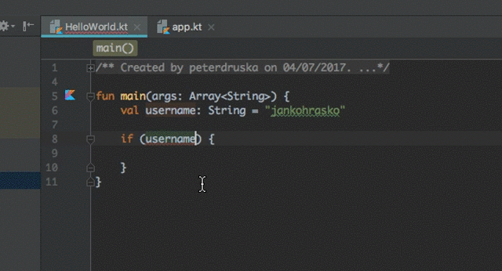

#### Zanorené podmienky

Podmienky sa dajú do seba (v prípade fakt nutnej potreby) aj zanárať:

```kotlin
if (PODMIENKA) {
    if (PODMIENKA2) {
        if (PODMIENKA3) {
            if (PODMIENKA4) {
                if (PODMIENKA5) {
                }
            }
        } else {
            if (PODMIENKA6) {
                // Ale bacha na to, lebo sa môžeš stratiť tak, ako sa len podmienka v podmienke môže stratiť!
            }
    } else {
        // Tu už končia všetky srandy.
    }
}
```

## Podmienky `when`

Okrem podmienok `if` máme v jazyku Kotlin ešte aj podmienky `when`. Tento príkaz môžeme chápať ako prepínač, alebo rozhodovač stavov. Majme číslo, o ktorom chceme rozhodnúť, do ktorého intervalu patrí:

```kotlin
val x: Int = 42

when (x) {
    in 1..10 -> print("Číslo $x patrí do intervalu [1, 10]")
    in 11..20 -> print("Číslo $x patrí do intervalu [11, 20]")
    in 21..30 -> print("Číslo $x patrí do intervalu [21, 30]")
    in 31..40 -> print("Číslo $x patrí do intervalu [31, 40]")
    in 41..50 -> print("Číslo $x patrí do intervalu [41, 50]")
    else -> print("Číslo $x nepatrí do žiadneho z uvedených intervalov.")
}
```

Vetva `else` je na to, aby sme zachytili aj možnosť, ktorá ja iná, ako všetky vymenované v prepínači. Prípadne ak chceme iba zistiť, o aké číslo sa jedná a vypísať jeho slovné pomenovanie:

```kotlin
val number: Int = 2

when (number) {
    1 -> print("Jeden")
    2 -> print("Dva")
    3 -> print("Tri")
    else -> print("Číslo neviem pomenovať.")
}
```

Dá sa aplikovať aj na reťazce:

```kotlin
val name: String = "Peter"

when (name) {
    "Peter" -> println("$name, urob niečo!")
    "Veronika" -> println("$name, oddýchni si!")
    else -> println("$name, teba nepoznám!")
}
```

## Zoznamy

Zoznamy sú super a neskôr zistíš, prečo.

Majme **zoznam** čísel, ktoré sa definuje volaním funkcie `listOf()`:

```kotlin
val fib = listOf(1, 1, 2, 3, 5, 8, 13, 21)
```

(Kto zistí, o akú postupnosť čísel sa jedná a aké by boli ďalšie čísla?)

Keď chceme vypísať konkrétny prvok tohto zoznamu, jednoducho to spravíme volaním mena zoznamu `fib` s uvedením indexu prvku do hranatých zázvoriek takto:

```kotlin
println(fib[0]) // Vypíše prvé číslo 1
```

**Číslovanie indexov začína pri zoznamoch od nuly.** Na to pamätaj, budeš to potrebovať! Vypísanie posledného prvku v terajšom zozname sa dá urobiť takto:

```kotlin
println(fib[7]) // Vypíše posledné číslo 21
```

Ale lepšie to je urobiť takto:

```kotlin
println(fib.last()) // Vypíše posledný prvok bez ohľadu na veľkosť zoznamu
```

Takto sa dá vypísať prvý prvok:

```kotlin
println(fib.first()) // Vypíše prvý prvok
```

Vymeniť hodnotu na konkrétnom mieste je jednoduché a robí sa takto:

```kotlin
fib[0] = 4 // Miesto pôvodnej 1 na nultom mieste bude teraz číslo 4
```

Dá sa rozhodnúť, či je zoznam prázdny volaním funkcie `isEmpty()` nad daným zoznamom:

```kotlin
if (fib.isEmpty()) {
    println("Zoznam je prázdny")
}
```

Prípadne zistiť, či sa v zozname nachádza konkrétny prvok:

```kotlin
if (fib.contains(5)) {
    println("Zoznam obsahuje číslo 5")
}
```

Zoznamy nemusia byť len celočíselné, ako je to v prípade zoznamu `fib`, ale aj plné reťazcov:

```kotlin
val names = listOf("Veronika", "Matej", "Jakub")
```

Môžu byť aj zmiešané:

```kotlin
val allOrNothing = listOf("Peter", 42, -3.14)
```

Zoznam `allOrNothing` obsahuje jeden reťazec, jedno celé číslo a jedno reálne číslo. S ním sa pracuje tiež rovnako, ako s akýmkoľvek iným zoznamom.

S takým zoznamom sa dá robiť presne to isté, čo s číselným zoznamom. Zisťovať, či obsahuje nejaký prvok, či je prázdny alebo získať konkrétny prvok zoznamu.

### Zmena zoznamu

Povedzme, že chceme zoznam `fib` doplniť o ďalšie prvky. Urobiť to nemôžeme, lebo vo svojom základe je zoznam nemenný, definovaný funkciou `listOf()`. Keď ho chceme dopĺňať, alebo prvky odstraňovať, musíme ho definovať ako meniteľný takto:

```kotlin
val fib = mutableListOf(1, 1, 2, 3, 5, 8, 13, 21)
```

Teraz dokážeme do zoznamu **pridať nové prvky** pomocou funkcie `add()`:

```kotlin
fib.add(55)
```

Takéto volanie jednoducho pridá do zoznamu `fib` na jeho koniec nový prvok `55`. Keď chceme vložiť konkrétny prvok na konkrétne miesto, nie na koniec, musíme určiť index, na ktorý tento prvok vkladáme:

```kotlin
fib.add(8, 34)
```

V tomto prípade na index číslo `8` vkladáme do zoznamu číslo `34`. Je dobré si priebežný stav zoznamu kontrolovať jednoduchým výpisom:

```kotlin
println(fib)
```

Zo zoznamu vieme **prvky aj odstraňovať** pomocou funkcie `removeAt()`:

```kotlin
fib.removeAt(3)
```

Táto funkcia odstráni zo zoznamu prvok na konkrétnom indexe. Prípadne sa dá použiť funkcia `remove()`:

```kotlin
fib.remove(13)
```

Treba spomenúť, že tu sa **odstraňuje konkrétny prvok zo zoznamu.** Ešte lepšie to ale vidno na zozname mien `names`, ktorý musíme najskôr definovať ako meniteľný:

```kotlin
val names = mutableListOf("Veronika", "Matej", "Jakub")
names.add("Barbora") //  Pridáme nový prvok
println(names)

names.remove("Matej") // Odstránime konkrétny prvok
println(names)

names.removeAt(0) // Odstránime prvok na indexe 0
println(names)
```

## Cykly

Cyklus, to je niečo, čo sa neustále opakuje. Napríklad východ Slnka sa opakuje každý deň. Rovnako aj jeho západ.

[](images/sunrise_sunset.gif)

Každý deň si umývaš zuby, obliekaš sa. Každý deň ráno vstaneš, naješ sa približne v ten istý čas alebo, keď si hladný/hladná. Celý náš život je prežívaný v cykloch.

Rovnako sú cykly dôležité aj v programovaní. V jazyku Kotlin rozlišujeme dva druhy cyklov:

- `for` cyklus s pevným počtom opakovaní. To je také, keď povieme, že niečo sa zopakuje 365 krát.
- `while` cyklus s opakovaním, kým je splnená podmienka. To je také, ako keď ti mama povie: *„Keď si upraceš izbu, pôjdeš von!“* Kľúčová je tá podmienka *„keď si upraceš izbu“.* Keď je podmienka splnená, cyklus škriepok končí.

### `For` cyklus

Keď chceme niečo zopakovať toľkokrát, koľko určíme. Často sa používa na prechádzanie zoznamov:

```kotlin
val names = mutableListOf("Veronika", "Matej", "Jakub")

for (name in names) {
    println(name)
}
```

Vymenovanie prvkov zoznamu `names` sa robí tak, že do zátvoriek za slovo `for` sa uvedie názov konštanty (`name`), do ktorej sa pri každom opakovaní vloží vždy nasledujúca hodnota zoznamu `names` takto: `(name in names)`. Slovo `in` znamená samozrejme *„v“*. Čiže tento cyklus sa dá prečítať takto **„pre každé meno v menách opakuj“**.

V cykle vieme prechádzať akýkoľvek zoznam:

```kotlin
val allOrNothing = listOf("Peter", 42, -3.14)

for (element in allOrNothing) {
    println(element)
}
```

V každom opakovaní (iterácii) sa do konštanty `element` dostanú postupne prvky poľa `allOrNothing`.

V cykle sa dá prejsť každý znak reťazca:

```kotlin
val name: String = "Janko Hraško"

for (char in name) {
    println(char)
}
```

Preto je to možné, lebo reťazce sú tiež kolekcie. Konkrétne kolekcie znakov.

Zaujímavé je cykly spájať s podmienkami. Napríklad ak chceme spočítať, koľko znakov **o** sa nachádza v reťazci:

```kotlin
val name: String = "Janko Hraško"
var count: Int = 0

for (char in name) {
    if (char == 'o') {
        count = count + 1
    }
}
println("Písmeno „o“ sa v reťazci „$name“ nachádza $count krát.")
```

### `While` cyklus

Kým je splnená riadiaca podmienka, cyklus bude bežať. Takže bacha na zacyklenie, na tzv. nekonečný cyklus (ang. infinite loop). Napríklad skúsme to najprv veľmi jednoducho, že keď číslo dosiahne hodnotu 100000 (stotisíc), tak cyklus skončí. V jeho tele postupne tieto čísla vypíšme. Vypisovať ich ručne by dalo jednému asi trochu zabrať:

```kotlin
var number: Int = 0
while (number <= 100000) {
    println(number)
    number = number + 1 // treba ho zväčšovať o jedna, inak by to bol nekonečný cyklus
}
```

Premennú `number` musíme nechať zväčšiť o `1`, pretože sa touto hodnotou chceme dostať až na 100000. Bez zväčšovania by to nenastalo a cyklus by donekonečna vypisoval hodnotu nula. Nikdy by sa nezastavil.

Dobre, aby sme si naliali čistej Kofoly, vypísať stotisíc čísel nie je až taká práca. Čo v prípade, keď všetky tie čísla chceme spočítať?

```kotlin
1 + 2 + 3 + 4 + 5 + … + 99999 + 100000 = ?
```

V matematike by sme na to rozžhavili [vzorec na výpočet súčtu aritmetickej postupnosti](https://sk.wikipedia.org/wiki/Aritmetická_postupnosť). Programovanie má v tomto obrovskú výhodu, že výpočty si vďaka tomu môžeme zjednodušiť. Samozrejme, matematike sa v programovaní nevyhneme, skôr naopak, je tu prítomná neustále. Súčet aritmetickej postupnosti do 100000 vieme urobiť takto:

```kotlin
var number: Int = 0
var sum: Int = 0

while (number <= 100000) {
    sum = sum + number // postupne k pôvodnej sume pridávame nové číslo a vložíme naspäť do sumy
    number = number + 1 // vstupuje do podmienky, preto postupne navyšujeme
}
println("1 + 2 + … + 99999 + 100000 = $sum")
```

## Funkcie

Predstavte si situáciu, keď pri programovaní musíte napísať tisíckrát to isté. Jeden by sa z toho aj zbláznil. Programovanie má to čaro, že si vďaka nemu viete veci zjednodušovať. Na ušetrenie času pri písaní toho istého má programovanie **funkcie**.

Sú to malé kúsky kódu, ktoré niečo robia. Niečo, čo v celom programe použijeme minimálne raz. Sú logicky uzavreté, čo znamená, že jedna funkcia napríklad zisťuje maximum z dvoch čísel, druhá funkcia bude určovať, či je číslo kladné, záporné alebo nula, ďalšia zašifruje reťazec, atď.

Ukážme si, ako na to v jazyku Kotlin.

### Holé funkcie

Funkcia sa definuje takto:

```kotlin
fun helloWorld() {
    // Tu pôjdu príkazy funkcie
}
```

Toto je najzákladnejší spôsob definovania funkcie. Popíšme si ju. Najprv ide vyhradené slovo `fun`, za ktorým nasleduje meno funkcie `helloWorld`. To môžeme napísať, aké chceme, ale s malým začiatočným písmenom a ideálne čo najviac popisné, že čo funkcia robí. Potom nasledujú okrúhle zátvorky `()`, do ktorých zatiaľ nič nedávame. Nasledujú zložené zátvorky `{}`, do ktorých napíšeme nejaké príkazy podľa toho, čo od funkcie chceme, aby robila. Tak urobme funkciu, ktorá vypíše *Hello World!*

```kotlin
fun helloWorld() {
    println("Hello World!")
}
```

**BACHA!** Aby sme však predišli chybám, funkcie sa nedefinujú do žiadnej inej funkcie. Čiže **akúkoľvek funkciu napíšeme mimo funkciu `main`**.

Keď chceme funkciu `helloWorld()` zavolať, aby vypísala požadovaný text, musíme tak učiniť v inej funkcii. Pre zjednodušenie ju zavoláme vo funkcii `main` tak, že napíšeme jej meno a prázdne okrúhle zátvorky:

```kotlin
fun main(args: Array<String>) {
    helloWorld()
}
```

Spustením programu sa teraz skutočne vypíše *Hello World!* Toto je však veľmi jednoduché použitie funkcie na to, aké magické čáry–máry to dokáže.

### Funkcie so vstupným parametrom

Skúsme teraz do zadaného textu, napr.:

```kotlin
Európska Únia je mierový projekt!
```

Vložiť medzery po každom znaku tak, že výsledok bude takýto:

```kotlin
E u r ó p s k a   Ú n i a   j e   m i e r o v ý   p r o j e k t ! 
```

Do funkcie, ktorú si vytvoríme, budeme môcť zadať ľubovoľný text pri jej zavolaní, nielen ten vyššie. Preto bude vyzerať takto:

```kotlin
fun printWithSpaces(text: String) {
    for (char in text) {
        print(char + " ") // Vypíše znak po znaku, za ktorým nasleduje medzera
    }
}
```

Vidíme, že funkcia ako taká neobsahuje text, ktorým ňou chceme upravovať. Zápis `printWithSpaces(text: String)` hovorí o tom, že do funkcie bude **vstupovať** reťazec (typ `String`), ktorý sa vloží do konštanty menom `text`. Zavolajme túto funkciu vo funkcii `main`:

```kotlin
fun main(args: Array<String>) {
    printWithSpaces("Európska Únia je mierový projekt!")
}
```

Tu už vidno text, ktorý sme si na začiatku určili, ako ukážku.

Keď sa takto funkcia zavolá, začne sa jej vnútro vykonávať. Vstupuje do nej reťazec `Európska Únia je mierový projekt!`, ktorý sa uloží do konštanty `text`. Ten sa začne spracovávať `for` cyklom znak po znaku. Každý znak vypíšeme volaním funkcie `print()` s tým, že za ten znak pridáme medzeru: `char + " "`.

A je to!

### Funkcie s výstupným parametrom

Ako sme do funkcie dali vstúpiť hodnote (typu `String`), tak vieme dať hodnote aj vystúpiť z funkcie. Napríklad si vymyslime takú, ktorej výstupom bude dnešný dátum typu `Date`:

```kotlin
fun getCurrentDate(): Date {
    return Date()
}
```

Do tejto funkcie `getCurrentDate()` nevstupuje žiadna hodnota žiadneho typu, ale vystupuje jedna typu `Date`. Novinkou pri týchto funkciách, ktoré **majú návratovú hodnotu**, je posledný príkaz `return`. Tu bude hodnota, ktorú vrátime z funkcie a musí byť rovnakého typu, ako je uvedené v definovaní vlastnej funkcie.

Zavolaním funkcie v inej funkcii získame skutočne dnešný dátum, ten musíme však vhodne spracovať, aby sme s ním mohli niečo urobiť:

```kotlin
fun main(args: Array<String>) {
    val currentDate = getCurrentDate()
    println(currentDate)
}
```

V tomto prípade **navrátenú hodnotu** uložíme do konštanty `currentDate`, ktorú následnej vypíšeme pomocou funkcie `println()`.

### Funkcie so vstupným i výstupným parametrom

Funkcie môže byť aj také, že hodnoty do nich **vstupujú i vystupujú**. Zistime napríklad maximum z dvoch čísel:

```kotlin
fun max(a: Int, b: Int): Int {
    if (a >= b) {
        return a
    } else {
        return b
    }
}
```

Ako vidíme, do funkcie `max()` **vstupujú** dva parametre `a` a `b`, obidva typu `Int`. **Výstupná** hodnota má byť taktiež typu `Int`. Vo vnútri funkcie je podmienka, ktorá zisťuje, či hodnota v konštante `a` je väčšia od `b`, v takom prípade funkcia vráti hodnota `a` príkazom `return a`. Inak vráti hodnotu b príkazom `return b`.

Použitie funkcie `max()` bude napríklad takéto:

```kotlin
fun main(args: Array<String>) {
    val maximum = max(12, 42)
    println(maximum)
}
```

Najprv do konštanty `maximum` vložíme výsledok volania funkcie `max(12, 42)`.

```kotlin
a = 12
b = 42
```

Funkcia zistí, že `b` je väčšie ako `a` a hodnotu `42` následne vráti ako svoju návratovú hodnotu, ktorá je uložená do konštanty `maximum`. Jej hodnotu potom vypíšeme riadkom `println(maximum)`.

Čiže ešte raz, vstupujú dve hodnoty, vystupuje jedna.

Funkcie sú mocný nástroj programátora, no pracujeme v objektovo orientovanom jazyku, preto musíme zájsť ešte ďalej. Potom sa odkryjú nekonečné možnosti vesmíru programovania, v ktorom sa dá urobiť čokoľvek. Naprogramovať jednoduchá hra, alebo umelá inteligencia riadiacia auto.

## Objekty a triedy

### Objekty okolo nás

Keď sa pozrieme na svet, ktorý nás obklopuje, dívajme sa pozorne. Lebo to, čo vidíme, sú objekty, ktoré môžeme zaradiť do tried. Napríklad máme triedu **pes**, ktorej objektami sú tie konkrétne psy, ktoré sme dnes stretli cestou do školy alebo práce.

Tak isto sa to dá tvrdiť o čomkoľvek. Obklopujú nás triedy:

- strom
- dom
- auto
- motorka
- ulica
- človek
- …

Tieto triedy ešte neurčujú mňa, teba, kohoľvek alebo čokoľvek v priestoročase. Až **tvoj výskyt na tejto planéte definuje teba ako konkrétny objekt triedy človek**. Tvoji rodičia sú tiež objektami triedy človek.

#### Vlastnosti človeka

Trieda **človek** má napríklad tieto vlastnosti:

- pohlavie
- vek
- farba pleti
- vierovyznanie
- štátna príslušnosť
- farba očí
- farba vlasov
- dátum narodenia
- povolanie

Trieda **človek** má napríklad tieto metódy:

- najedzSa()
- vyprázdniSa()
- zoznámSa(s: Človek)
- zomri()
- naroďSa(d: Dátum)
- podajRuku()
- kráčaj()
- bež()

Vymyslieť sa ich dá veľa. Presne podľa toho, čo akýkoľvek človek dokáže robiť.

### Definovanie triedy

Programovanie ide ďalej, dáva nám moc čarovnej paličky Heňa Hrnčiara na to, aby sme mohli vytvárať triedy, ktoré v reálnom svete v podstate ani neexistujú rovnako, ako tie, čo existujú. Väčšinou však budeme kopírovať reálny svet.

Vytvorme teraz triedu s názvom `Person`:

```Kotlin
class Person() {
}
```

Je to veľmi jednoduché. Najprv ide vyhradené slovo `class`, za ktorým nasleduje vlastné meno triedy `Person`. To volíme my, dávame mu veľké písmeno, lebo tak sme sa dohodli, aby sa ľahšie odlišovalo od názov premenných a konštánt, ktoré sa píšu s malými začiatočnými písmenami. Za menom idú (zatiaľ) prádzne okrúhle zátvorky `()` a za nimi blok uzavretý v zložených zátvorkách `{}`.

### Objekty danej triedy

Zatiaľ sme žiadneho človeka nevytvorili. Definovali sme si len triedu a jej správanie sa k okoliu. Dajme život prvému človekovi nášho programu:

```kotlin
val adam = Person()
```

Vznikol tak človek triedy `Person`, ktorého konštanta nesie meno `adam`.

### Metódy

S týmto človekom nie je moc zábavy. Preto všeobecnej triede skúsme pridať pár metód. To sú vlastne funkcie, ktoré sú uzavreté do nejakej triedy:

```Kotlin
class Person() {
    fun speak() {
        println("Hello!")
    }
}
```

Teraz vie `adam` rozprávať. Síce trochu obmedzenie, ale vie:

```kotlin
val adam = Person()
adam.speak() // Vypíše text implementovaný v metóde speak()
```

Povedzme, že je slušné Evu pozdraviť, tak definujme metódu na pozdravenie konkrétneho človeka:

```Kotlin
class Person() {
    fun speak() {
        println("Hello!")
    }
    
    fun greet(name: String) {
        println("Hello $name!")
    }
}
```

Následne pozdrav vyvoláme takto:

```kotlin
val adam = Person()
adam.speak()
adam.greet("Eva") // Adam pozdraví Evu
```

Bolo by dobré, aby sme poznali aspoň rok narodenia a meno človeka `adam`. Meno konštanty je niečo iné, ako meno človeka. Takýmto hodnotám hovoríme **vlastnosti**.

### Vlastnosti

Aby sme človekovi pridali možnosť zadať meno a vek, musíme upraviť prázdne okrúhle zátvorky `()` za menom triedy takto:

```kotlin
class Person(val name: String, var age: Int) {
    fun speak() {
        println("Hello!")
    }
    
    fun greet(name: String) {
        println("Hello $name!")
    }
}
```

Tento zápis:

```kotlin
Person(val name: String, var age: Int)
```

je to, čo je dôležité. Sú to vlastnosti `name`, `age` danej triedy, ktoré pomáhajú lepšie rozpoznať konkrétneho človeka (objekt). Preto Adama vytvoríme teraz takto:

```kotlin
val adam = Person("Adam", 27)
adam.speak()
adam.greet("Eva")
```

Do vlastnosti `name` sme týmto vložili textovú (`String`) hodnotu `Adam` a do vlastnosti `age` celočíselnú (`Int`) hodnotu `27`. Meno je nemenné, preto ho definujeme vyhradeným slovom `val` pre konštantu a vek sa mení každý rok, preto ho definujeme vyhradeným slovom `var` pre premennú.

Povedzme, že Ábel chce vedieť rok narodenia svojho otca Adama. Definujeme preto novú metódu `getYearOfBirth()`:

```kotlin
class Person(val name: String, var age: Int) {
    fun speak() {
        println("Hello!")
    }
    
    fun greet(name: String) {
        println("Hello $name!")
    }
    
    fun getYearOfBirth(): Int {
        return 2017 - age
    }
}
```

Vek následne zistíme takto:

```kotlin
val adam = Person("Adam", 27)
adam.speak()
adam.greet("Eva")
val yearOfBirth = person.getYearOfBirth() // uloženie roku narodenia uložíme do konštanty
println(yearOfBirth) // hodnotu vypíšeme
```

Teraz program vypíše rok narodenia Adama, ak je rok 2017 a on má v tom roku 27 rokov.

*Objekty tried môžeme volať v cykloch, v podmienkach, robiť s nimi rôzne zaujímavé veci. Hlavne nám slúžia na pohodlnejšiu prácu s dátami, ktoré program spracováva a vytvára.*

### Dedičnosť

Čo by to bol za svet, keby triedy po sebe nededili? Dieťa dedí vlastnosti po rodičoch, dokonca aj niektoré spôsoby (metódy) správania. Dedičnosť sa nemusí viazať len na živé veci. Napríklad **trieda štvorec** dedí po triede **geometrický tvar** vlastnosť `početStrán` alebo metódu `vypočítajObsah()`, ktorá však má inú implementáciu (inak funguje pre štvorec a inak pre trojuholník).

Rozšírme preto triedu `Person` tak, aby sme mohli vytvoriť ďalšie triedy, ktoré po nej budú dediť:

```kotlin
open class Person(open val name: String, open var age: Int) {
    // …
}
```

Všimnime si, že pred vyhradené slovo `class` sme pridali vyhradené slovo `open`, ktoré označuje triedu, z ktorej budeme vytvárať potomkov. Rovnako aj vlastnosti, ktoré chceme, aby potomkovia dedili, označíme klauzulou `open`. Celá trieda teraz vyzerá takto:

```kotlin
open class Person(open val name: String, open var age: Int) {
    fun speak() {
        println("Hello!")
    }
    
    fun greet(name: String) {
        println("Hello $name!")
    }
    
    fun getYearOfBirth(): Int {
        return 2017 - age
    }
}
```

Teraz vytvorme triedu `Student`, ktorá bude potomkom triedy `Person`:

```kotlin
class Student(override val name: String, override var age: Int, val studentID: Long): Person(name, age) {
    // …
}
```

Takáto trieda sa už neoznačuje `open`, ale vo svojich parametroch uvádza tie isté vlastnosti, ako s[ v rodičovskej triede s klauzulou `override`, ktorá označuje, že daná vlastnosť sa bude dediť z rodičovskej triedy a prepisovať v triede potomka. Plus pridáva novú vlastnosť označenú parametrom `val studentID: Long`. To, že trieda `Student` je potomkom triedy `Person` určíme tak, že za definovanie mena a vlastností triedy pridáme dvojbodku, za ktorou nasleduje meno rodičovskej triedy s uvedením vlastností, ktoré sú predmetom dedenia.

#### Finta fň

Teraz môžeme urobiť fintu, ktorá robí z dedičnosti mocný nástroj programátora. Prepíšme aj metódy `speak()` a `greet()`. Najprv ich v rodičovskej triede `Person` musíme označiť klauzulou `open`:

```kotlin
open class Person(open val name: String, open var age: Int) {
    open fun speak() {
        println("Hello!")
    }
    
    open fun greet(name: String) {
        println("Hello $name!")
    }
    
    fun getYearOfBirth(): Int {
        return 2017 - age
    }
}
```

A následne v triede `Student` prepísať uvedením klauzuly `override` a implementovať iné správanie:

```kotlin
class Student(override val name: String, override var age: Int, val studentID: Long): Person(name, age) {
    override fun speak() {
        println("Hi there, I'm a student!")
    }

    override fun greet(name: String) {
        println("Howdy, $name")
    }
}
```

Stačí, ak v IntelliJ IDEA napíšeme meno metódy, ktorú ideme prepísať a program to automaticky doplní so všetkým, čo treba.

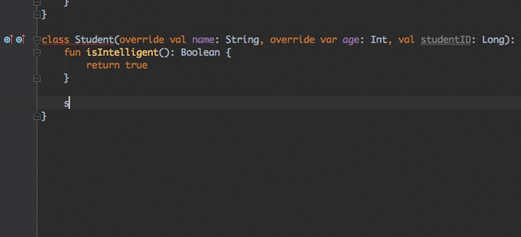

Do triedy `Student` môžeme pridať aj nové metódy, ktoré rodičovská trieda neimplementuje:

```kotlin
fun isIntelligent(): Boolean {
    return true
}
```

Celá trieda bude vo výsledku vyzerať takto:

```kotlin
class Student(override val name: String, override var age: Int, val studentID: Long): Person(name, age) {
    fun isIntelligent(): Boolean {
        return true
    }

    override fun speak() {
        println("Hi there, I'm a student!")
    }

    override fun greet(name: String) {
        println("Howdy, $name")
    }
}
```

Vytvorme teraz triedu `Employee`, ktorá bude tiež dediť z triedy `Person` a bude implementovať aj jednu novú metódu:

```kotlin
class Employee(override val name: String, override var age: Int): Person(name, age) {
    fun receivePayment() {
        println("Payment received.")
    }

    override fun speak() {
        println("Hi, I'm an employee!")
    }
}
```

Všetky tri triedy pohromade pripravené na použitie vo funkcii `main`:

```kotlin
open class Person(open val name: String, open var age: Int) {
    open fun speak() {
        println("Hello!")
    }
    
    open fun greet(name: String) {
        println("Hello $name!")
    }
    
    fun getYearOfBirth(): Int {
        return 2017 - age
    }
}

class Student(override val name: String, override var age: Int, val studentID: Long): Person(name, age) {
    fun isIntelligent(): Boolean {
        return true
    }

    override fun speak() {
        println("Hi there, I'm a student!")
    }

    override fun greet(name: String) {
        println("Howdy, $name")
    }
}

class Employee(override val name: String, override var age: Int): Person(name, age) {
    fun receivePayment() {
        println("Payment received.")
    }

    override fun speak() {
        println("Hi, I'm an employee!")
    }
}
```

#### Vytvorenie objektov tried potomkov

Máme definovanú rodičovskú triedu `Person` a dve triedy ako jej potomkov: `Student` a `Employee`. Použime ich teraz vo funkcii `main`.

Najprv vytvoríme študenta:

```kotlin
val student = Student("John", 25, 16416464)
student.speak()
student.greet("Marry")
println(student.isIntelligent())
```

Bude sa volať John, má 25 rokov a študentské ID je 16416464. Následne voláme metódy `speak()`, aby hovoril a `greet("Marry")`, aby pozdravil Marry. Nakoniec vypíšeme, či je študent inteligentný.

Vytvorme teraz zamestnanca:

```kotlin
val employee = Employee("Marry", 32)
employee.speak()
employee.receivePayment()
```

Je to žena, volá sa Marry a má 32 rokov. Najprv jej dáme slovo `speak()` a potom prijme od nás, ako zamestnávateľa, platbu `receivePayment()`.

Celá funkcia `main`:

```kotlin
fun main(args: Array<String>) {
    val student = Student("John", 25, 16416464)
    student.speak()
    student.greet("Marry")
    println(student.isIntelligent())

    val employee = Employee("Marry", 32)
    employee.speak()
    employee.receivePayment()
}
```

### Abstraktná trieda

Pozornému oku neušla jedna vec. Že sme vytvárali len objekty tried `Student` a `Employee`. Nevytvorili sme žiaden objekt triedy `Person`. To naznačuje, že tá trieda nebude ani v budúcnosti použitá na vytvortenie konkrétnych objektov, lebo nám ide hlavne o jej potomkov. V takom prípade triedu `Person` môžeme definovať ako **abstraktnú**. Iba miesto klauzuly `open` použijeme klauzulu `asbtract` (tá je automaticky aj `open`):

```kotlin
abstract class Person(open val name: String, open var age: Int) {
    // …
}
```

Tým môžeme urobiť ešte jednu vec. A síce prehlásiť niektoré metódy za abstraktné, ak bude ich použitie (implementácia) iná v každej triede potomka. Napríklad metdóda `speak()` je iná v triede `Student` a iná v triede `Employee`. Preto v abstraktnej triede `Person` ju tiež definujeme ako abstraktnú:

```kotlin
abstract class Person(open val name: String, open var age: Int) {
    abstract fun speak()
    // …
}
```

Ostatné veci ostanú zachované rovnako, ako boli uvedené skôr.

### Rozhranie `interface`

`Interface` môžeme chápať ako sadu vlastností a metód, ktoré sú určené na implementáciu triedou, ktorá je definovaná v tomto rozhraní. Majme napríklad rozhranie, ktoré nazveme, že je **šoférovateľné** (ang. **Driveable**):

```kotlin
interface Driveable {
    fun drive() // abstraktná metóda
}
```

Rozhranie `Driveable` definuje jedinú metódu `drive()`, ktorá určuje, či niečo dokáže jazdiť. **Ale čo je to niečo?** To niečo bude trieda, o ktorej chceme prehlásiť, že jej objekty budú schopné jazdiť. Napríklad autá, motorky, bicykle, … Triedy potom definujeme tak, ako keby dedili z inej triedy cez dvojbodku a názov rozhrania:

```kotlin
class Car(): Driveable {
    override fun drive() {
        println("Driving car…")
    }
}

class Motorcycle(): Driveable {
    override fun drive() {
        println("Driving motorcycle…")
    }
}
```

Následne **musíme** implementovať (samozrejme použijeme kaluzulu `override`) metódu `drive()` pochádzajúcu z rozhrania `Driveable`, lebo samotné rozhranie to nerobí. Ono iba definuje vlastnosti a metódy, ktoré je nutné implementovať, aby šoférovateľné objekty boli skutočne aj šoférovateľné:

```kotlin
fun main(args: Array<String>) {
    val car: Driveable = Car() // treba si všimnúť rozhranie Driveable aj tu
    car.drive()

    val motorcycle: Driveable = Motorcycle() // treba si všimnúť rozhranie Driveable aj tu
    motorcycle.drive()
}
```

### Trieda vymenovaného typu `enum`

Trieda vymenovaného typu, to je napríklad semafór:

- červená,
- oranžová,
- zelená.

Alebo základné rodinné vzťahy:

- mama,
- otec,
- dcéra,
- syn,
- sestra,
- brat.

Alebo základné farby:

- červená,
- oranžová,
- žltá,
- zelená,
- modrá,
- fialová.

Alebo vybrané slová po Z:

- jazyk,
- nazývať,
- ozývať,
- prezývať,
- vyzývať,
- pozývať,
- vzývať.

A podobne.

### X

…
